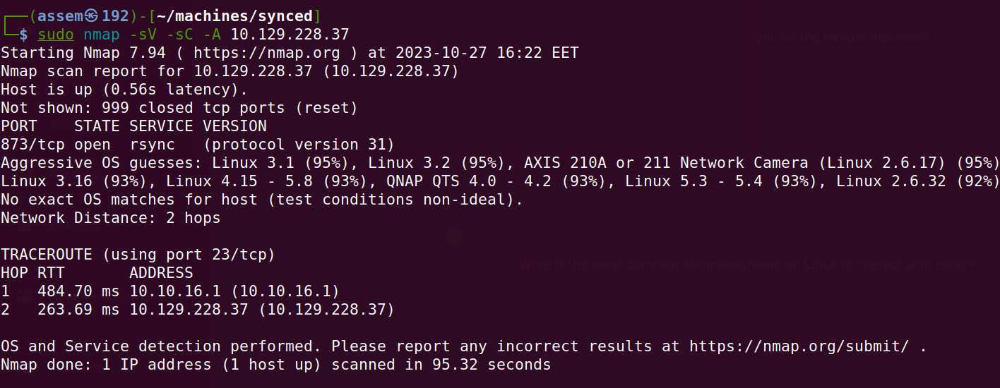
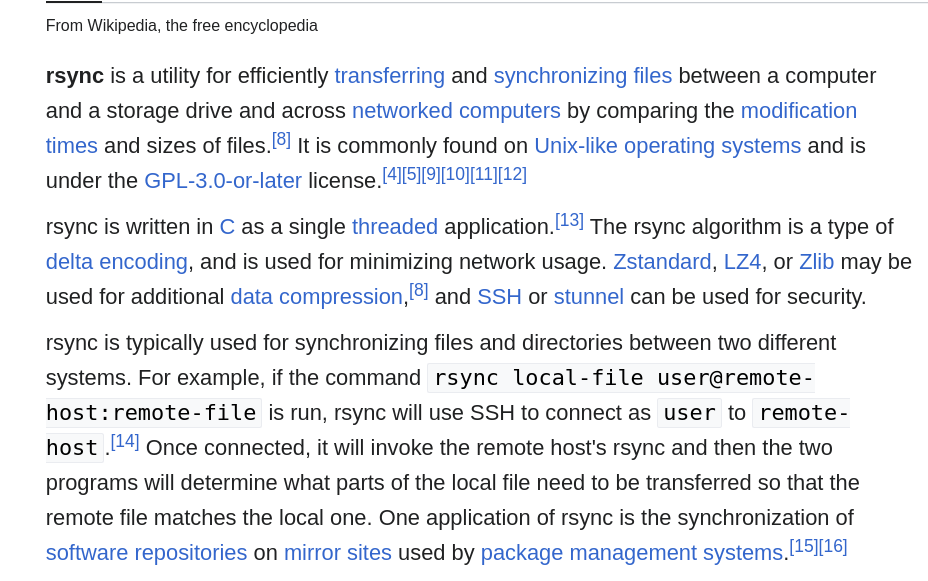
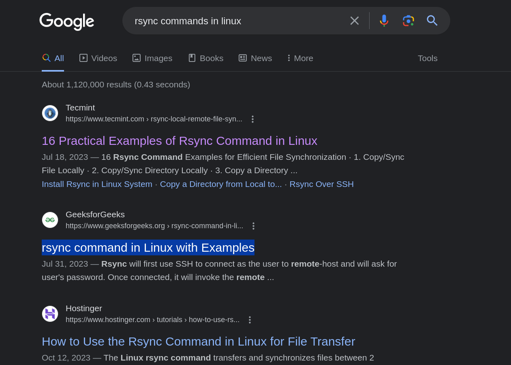
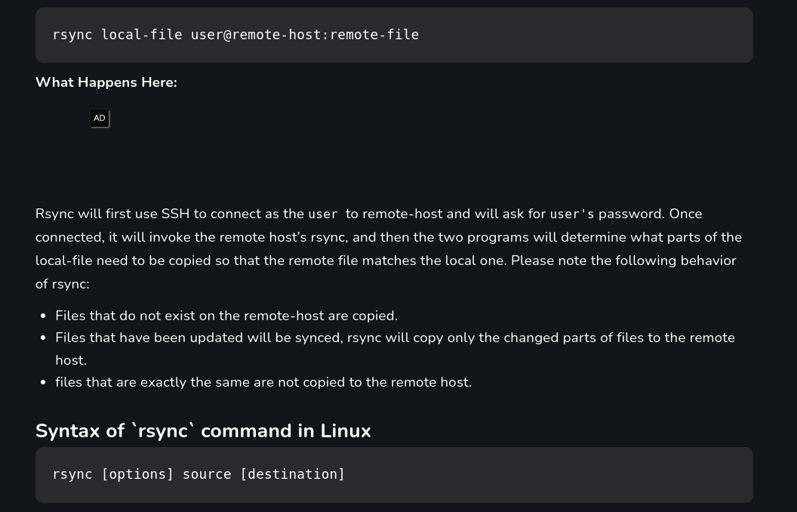
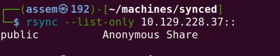
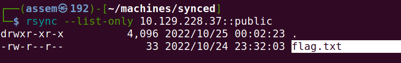
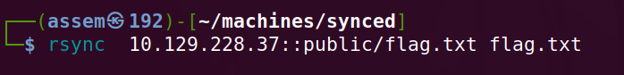
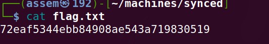

# Synced_Machine - Basics of penetration testing - HTB .

**In our journy to learn penetration testing basics we will take a machines in HTB to can explain the basics of penetration** 

## Every machine has a basic idea to deliver to you .

- in this machine you will learn the basics of dealing with websites attcks and the basics techniqe to get inside the website.

- in this machine you should get familiar with digging tools like `gobuster` and know how it works and how it run in your terminal.

### Enumeration .

- After connecting with vpn you will spawn the machine and you will have the ip address for this machine .

- As we explained in earlier machines you must know how to download vpn and connect with HTB server and ping for IP_address .

- We will skip all this and begin with the semplist tool which called `nmap` searching to check if we have any open ports.

- type this command in your terminal `sudo nmap -sV -sC -A {IP_address}` .

- Now as you can see in the previous image there is one open port we can deal with and search about any information can 
  lead us to a successful attack in this port .

- port `872/tcp` is open , this port have a running service called `rsync` ,the version of this service is 
   `(protocol version 31)` .

- I do not need you to get confused about your leak of knowledge  about this service , all hackers in the beginning was 
  like you , and this not a big deal you just need to do a quick search about this service and learn about how it work and how you can deal with it .

***in this step we will do a quick search about `rsync` service to make your hand more free with searching***

- we will begin with google search .

- in the previous image you will see what is the searching leading us to , in the next hints you will got my explaination 
  to rsync .

***take my explaination about rsync and why people use it***

- *Efficient File Transfer* : rsync uses a delta transfer algorithm, which means it only transfers the differences 
  between source and destination files, which significantly reduces the amount of data transferred, making it efficient 
  for syncing large files or directories.

- *Remote File Synchronization* : rsync supports both local and remote file transfers over SSH, which allows 
  synchronization between local and remote systems or mirroring directories across multiple machines.

- *Incremental Backups*  : rsync is well-suited for incremental backups, as it create and update backups efficiently by 
   transferring only new or modified files.

- *Preserves File Permissions* : rsync can preserve various file attributes, such as permissions, ownership, timestamps, 
   and symbolic links, which ensures that the copied files retain their original characteristics on the destination.

- *Bandwidth Control* : rsync allows you to limit the bandwidth usage during file transfers, as it uses compression and 
  decompression method while sending and receiving data on both ends.

- *Faster* : rsync can be faster than scp (Secure Copy) for transferring files, especially when syncing large directories 
  or when dealing with files that have already been partially transferred or exist on the destination.

- Now you should now what is rsync and how it work , let's know how we can connect to rsync .

- You can try with your hand to search in diffenet websites to know every possible information about rsync , and this how 
  you will act in every hacking scenario .

#### foothold 

- Now we will try to connect with rsync from our local machine .

- I know that you do not know what commands you can use to connect with rsync , then remeber our rule in hacking journy  
  "always search" , let's go to search and know what command we will use .

- Lets try to get in the second website "GeeksforGeeks" , and this from my experience this website will give you the best 
  view of dealing with rsync commands.

- I will contunie typing commands which I learned before and you can search more than search in the inserted images.

-  we will use this command `rsync --list-only {IP_address}::` to list all directories in the terget machine .

- As we noticed ther is two directories in the terget machine (public , anonymous share) , we will target the public one .

-  we will use this command `rsync --list-only {IP_address}::public` to list all files in public directorie.

- As we noticed ther is file called flag.txt and this is our target , now we need to copy this file to our local machine.

- we will use this command `rsync {IP_address}::public/flag.txt flag.txt` to list all directories in the terget machine .

- this command gives you no out put then you need to type `ls` in your terminal to see the flag.txt file in your local 
  machine .

- And now you got your flag type `cat {flag.txt}` in your terminal to read the file and solve the machine .

***Congratulations , Assem_Ayman_44***